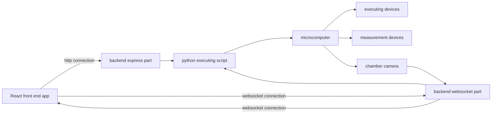

# Dry ager back-end application

This application was made to connect front-end with microcomputer which control executing devices.

Program also can sending commands to microcomputer for adjusting dry ager chamber parameters. It is integral part of dry ager device with control system. All system contains:

- front-end part

- backend part

- microcomputer

- executing devices

- measurement devices

## Dry age system scheme

## About application

This application it is a connection of express and websocket server. Websocket is used for sending to front end information’s about measurement values: chamber temperature and humidity.  Main task is to sending command to microcomputer about devices working. Program control dryer, two columns of cooling Poltier cells with fans, inside light and camera.

## Technologies

Application using node express server and websocket server. Also control executive python script sending to microcomputer by child process.

## Contact

To reach me use my email address: pileckidariusz90@gmail.com

## Copyrights

All code in this repository are free to use.